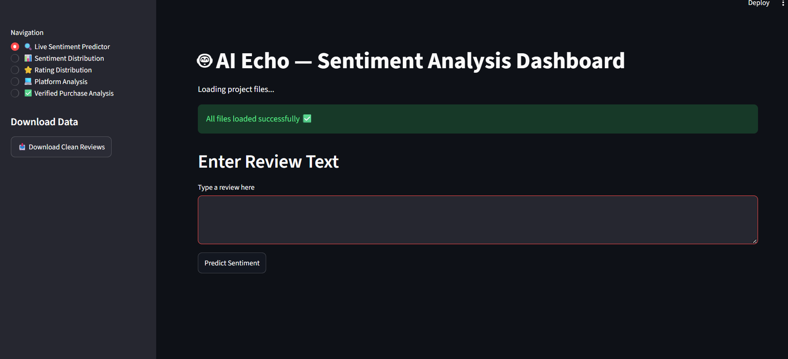
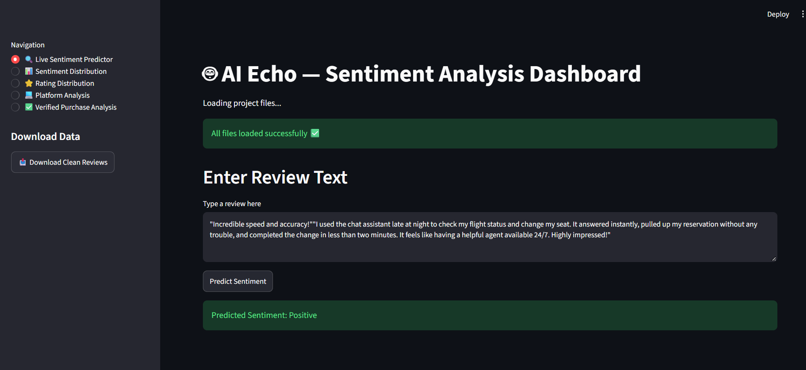
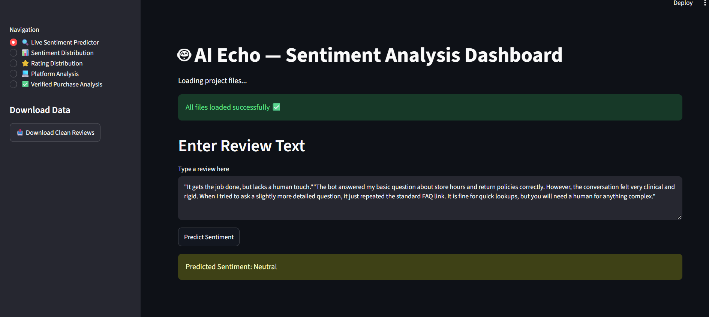
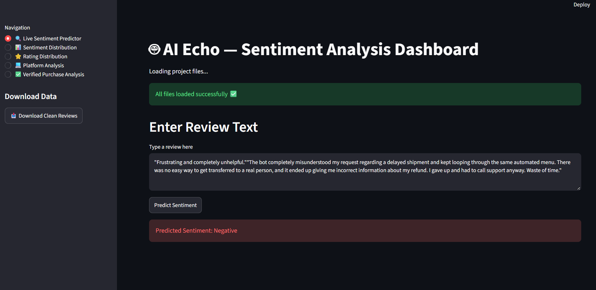

# 🤖 AI Echo – Sentiment Analysis Dashboard

AI Echo is a **Sentiment Analysis and Review Analytics application** built using Python, Machine Learning, TF-IDF and Streamlit.

The project analyzes ChatGPT-style user reviews and classifies them into:

- 🟢 Positive
- 🟡 Neutral
- 🔴 Negative

It also provides interactive analytics based on ratings, platforms and verified purchases.

---

# 📌 Problem Statement

User reviews contain valuable information about how people experience an application or service.

Manually analyzing a large number of reviews is time-consuming and makes it difficult to identify overall sentiment patterns.

The objective of AI Echo is to:

- Automatically classify reviews based on sentiment.
- Clean and preprocess textual review data.
- Convert text into numerical features using TF-IDF.
- Train a machine learning model for sentiment classification.
- Provide an interactive dashboard for review analysis.
- Allow users to test their own review text.

---

# 💡 Proposed Solution

AI Echo uses a Machine Learning pipeline to process review data.

The application performs:

1. Data loading
2. Data cleaning
3. Text preprocessing
4. Stopword removal
5. Lemmatization
6. TF-IDF feature extraction
7. Machine Learning classification
8. Sentiment prediction
9. Interactive visualization

The trained model is integrated into a Streamlit dashboard for real-time prediction and analysis.

---

# 🚀 Features

## 🔎 1. Live Sentiment Predictor

Users can enter their own review and receive an instant sentiment prediction.

The application classifies the input into:

- 🟢 Positive
- 🟡 Neutral
- 🔴 Negative

---

## 📊 2. Sentiment Distribution

Displays the distribution of reviews across different sentiment categories.

The results are displayed using:

- Bar chart visualization
- Data table

This helps understand the overall sentiment pattern in the dataset.

---

## ⭐ 3. Rating Distribution

Displays the number of reviews for each rating value.

This helps understand how ratings are distributed across the dataset.

---

## 📱 4. Platform Analysis

Analyzes sentiment based on the platform from which the review originated.

The application displays:

- Platform-wise sentiment counts
- Bar chart visualization
- Data table

---

## 🛒 5. Verified Purchase Analysis

Analyzes sentiment based on whether a purchase was verified or not.

The results are displayed using:

- Bar chart visualization
- Data table

This helps understand sentiment patterns among verified and non-verified purchases.

---

## 📥 6. Dataset Download

AI Echo provides an option to download the cleaned and processed review dataset directly from the Streamlit sidebar.

The downloadable dataset is:

```text
clean_reviews.csv
```

---

# 📸 Application Screenshots

## 🔎 Live Sentiment Predictor



---

## 🟢 Positive Sentiment Prediction



---

## 🟡 Neutral Sentiment Prediction



---

## 🔴 Negative Sentiment Prediction



---

# 🧹 Data Preprocessing

The review dataset undergoes several preprocessing steps before training the machine learning model.

### Preprocessing steps include:

1. Convert text to lowercase.
2. Remove URLs.
3. Remove numbers.
4. Remove special characters.
5. Normalize whitespace.
6. Tokenize the review text.
7. Remove stopwords.
8. Preserve important negation words such as:
   - `not`
   - `no`
   - `nor`
   - `never`
   - `n't`
9. Apply lemmatization.
10. Remove duplicate normalized reviews.

These steps help prepare the review text for machine learning.

---

# 🔤 TF-IDF Feature Extraction

The project uses **TF-IDF (Term Frequency-Inverse Document Frequency)** to convert textual reviews into numerical features.

The implementation uses:

```python
TfidfVectorizer(
    max_features=5000,
    ngram_range=(1,2)
)
```

The model considers:

- Unigrams
- Bigrams

This allows the machine learning model to work with textual review data.

---

# 🤖 Machine Learning

The project evaluates multiple machine learning algorithms using cross-validation.

The algorithms considered include:

- Logistic Regression
- Multinomial Naive Bayes
- Linear Support Vector Classifier

The model evaluation uses **5-fold cross-validation**.

The saved model used by the Streamlit application is a **Logistic Regression model**.

> Note: The saved model filename is `sentiment_nb_model.pkl`, but the actual model stored inside the file is Logistic Regression.

---

# 🎯 Sentiment Classification

The sentiment labels are generated from the review ratings.

| Rating | Sentiment |
|---|---|
| 1–2 | Negative |
| 3 | Neutral |
| 4–5 | Positive |

The trained model predicts one of the following classes:

```text
Negative
Neutral
Positive
```

---

# 📂 Dataset

The project uses a review dataset containing information such as:

- Review date
- Review title
- Review text
- Rating
- Username
- Helpful votes
- Review length
- Platform
- Language
- Location
- Version
- Verified purchase
- Sentiment
- Cleaned review text
- Tokenized text
- Normalized text

The processed dataset is stored as:

```text
clean_reviews.csv
```

---

# 🛠️ Technology Stack

## Programming Language

- Python

## Data Processing

- Pandas
- NumPy

## Natural Language Processing

- NLTK
- Stopword Removal
- WordNet Lemmatization
- Text Preprocessing

## Machine Learning

- Scikit-learn
- Logistic Regression
- Multinomial Naive Bayes
- LinearSVC
- TF-IDF

## Web Application

- Streamlit

## Model Storage

- Joblib

## Development Tools

- Jupyter Notebook
- VS Code
- Git
- GitHub

---

# 📁 Project Structure

```text
Aiechopartner/
│
├── aiecho.py
├── aiecho.ipynb
├── clean_reviews.csv
├── sentiment_nb_model.pkl
├── tfidf_vectorizer.pkl
├── requirements.txt
├── README.md
│
└── screenshots/
    ├── 01_live_sentiment_empty.png
    ├── 02_positive_prediction.png
    ├── 03_neutral_prediction.png
    └── 04_negative_prediction.png
```

---

# 📄 File Description

| File | Description |
|---|---|
| `aiecho.py` | Streamlit application |
| `aiecho.ipynb` | Data preprocessing and machine learning notebook |
| `clean_reviews.csv` | Cleaned and processed review dataset |
| `sentiment_nb_model.pkl` | Saved Logistic Regression sentiment model |
| `tfidf_vectorizer.pkl` | Saved TF-IDF vectorizer |
| `requirements.txt` | Required Python libraries |
| `README.md` | Project documentation |
| `screenshots/` | Application screenshots |

---

# ⚙️ Installation

Clone the repository:

```bash
git clone https://github.com/vetrivelann/Aiechopartner.git
```

Move into the project directory:

```bash
cd Aiechopartner
```

Create a virtual environment:

```bash
python -m venv venv
```

Activate the virtual environment.

### Windows

```bash
venv\Scripts\activate
```

Install the required dependencies:

```bash
pip install -r requirements.txt
```

---

# ▶️ Run the Application

Start the Streamlit application using:

```bash
streamlit run aiecho.py
```

The application will open in the browser.

---

# 🔄 Machine Learning Workflow

```text
Review Dataset
      ↓
Data Cleaning
      ↓
Text Preprocessing
      ↓
Stopword Removal
      ↓
Lemmatization
      ↓
Duplicate Removal
      ↓
TF-IDF Feature Extraction
      ↓
Model Training
      ↓
Model Evaluation
      ↓
Save Model & Vectorizer
      ↓
Streamlit Dashboard
      ↓
Live Sentiment Prediction
```

---

# 📈 Model Evaluation

Multiple machine learning algorithms were evaluated using cross-validation.

The evaluated models include:

```text
Logistic Regression
Multinomial Naive Bayes
LinearSVC
```

The project uses **5-fold cross-validation** to compare model performance during the machine learning workflow.

---

# 🎯 Project Objectives

The main objectives of AI Echo are:

- Build a text-based sentiment analysis system.
- Perform NLP preprocessing on user reviews.
- Convert textual data into numerical features.
- Apply machine learning for sentiment classification.
- Develop an interactive Streamlit dashboard.
- Provide real-time sentiment prediction.
- Analyze review patterns using visualizations.

---

# 📚 Learning Outcomes

Through this project, the following concepts were applied:

- Python programming
- Data preprocessing
- Exploratory Data Analysis
- Natural Language Processing
- Text cleaning
- Tokenization
- Stopword removal
- Lemmatization
- TF-IDF
- Machine Learning
- Model evaluation
- Cross-validation
- Model serialization
- Streamlit application development
- Git and GitHub project management

---

# ⚠️ Limitations

- The project uses a relatively small review dataset.
- Sentiment classification depends on the quality of the available review data.
- Text containing sarcasm or complex context may be difficult to classify accurately.
- Model performance may vary when used with reviews from different domains.

---

# 🔮 Future Improvements

Possible future improvements include:

- Use a larger real-world review dataset.
- Add more advanced NLP techniques.
- Experiment with transformer-based models.
- Add sentiment confidence scores.
- Add more detailed dashboard visualizations.
- Support additional languages.
- Deploy the application online.
- Add continuous model retraining with new reviews.

---

# 🌟 Project Highlights

- 🧹 Complete text preprocessing pipeline
- 🔤 TF-IDF based feature extraction
- 🤖 Machine Learning sentiment classification
- 📊 Interactive Streamlit dashboard
- 🔎 Live review prediction
- ⭐ Rating analysis
- 📱 Platform-based analysis
- 🛒 Verified purchase analysis
- 📥 Processed dataset download
- 📸 Documented application screenshots

---

# 👨‍💻 Author

**VETRIVELANN S**

Computer Science Student | Aspiring Data Scientist | AI/ML | Python | SQL | DSA

GitHub:

https://github.com/vetrivelann

---

# 📌 Project Status

**Completed**

The project includes data preprocessing, NLP feature extraction, machine learning model training, model serialization and an interactive Streamlit dashboard.
